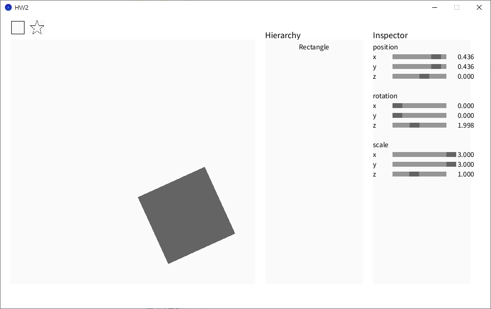
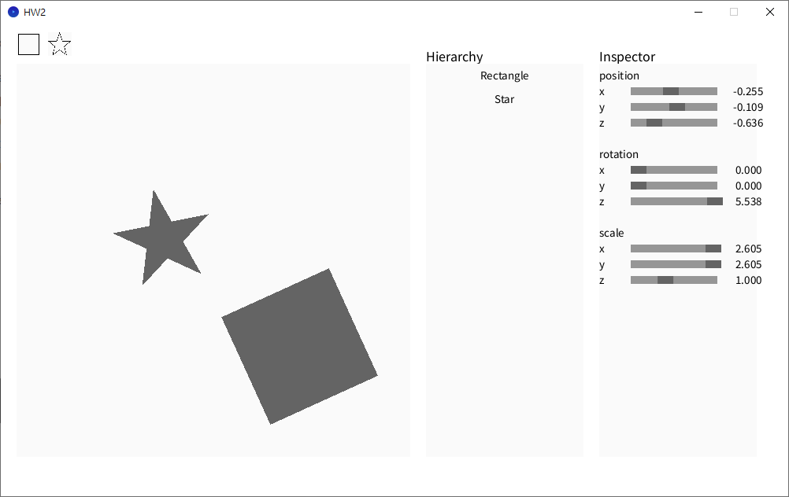

- [x] (20%) Correctly implement the 3 transformation matrices.
- Translation Matrix

|||||
|--------|--------|--------|--------|
| 1 | 0 | 0 | x |
| 0 | 1 | 0 | y |
| 0 | 0 | 1 | z |
| 0 | 0 | 0 | 1 |
- Rotation Matrix (Z-axis)
  
|||||
|--------|--------|--------|--------|
| cos(a) | sin(a) | 0 | 0 |
| -sin(a) | cos(a) | 0 | 0 |
| 0 | 0 | 1 | 0 |
| 0 | 0 | 0 | 1 |
- Scaling Matrix
  
|||||
|--------|--------|--------|--------|
| x | 0 | 0 | 0 |
| 0 | y | 0 | 0 |
| 0 | 0 | z | 0 |
| 0 | 0 | 0 | 1 |

- [x] (25%) Correctly implement pnpoly.
- Ray Casting Algorithm
  - 如果計數為奇數 → 點在內部
  - 如果計數為偶數 → 點在外部
- [x] (20%) Correctly implement the bounding box.
- 遍歷分別找x與y最大最小值
- [x] (35%) Correctly implement Sutherland Hodgman Algorithm.
-四種情況（針對邊界判斷）

|起點(S)	|終點(E)	|結果|
|--------|--------|--------|
|Inside	|Inside	|保留 E|
|Inside	|Outside	|保留交點|
|Outside	|Inside	|保留交點和 E|
|Outside	|Outside	|不保留任何點|
- 透過這樣逐邊裁剪，最終保留留在視窗內的多邊形部分。
- [x] [+1.5 Semester Score] Successfully implement SSAA
- 取放大後在2x2範圍內的數量將原本位置的顏色定為100x(放大後在2x2範圍內數量/4)
- 有運用ChatGPT輔助，聊天紀錄如下https://chatgpt.com/share/68fe2af1-3df8-8008-ae06-dd2118bb4cae

